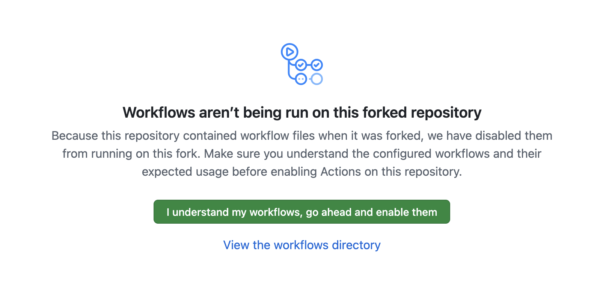
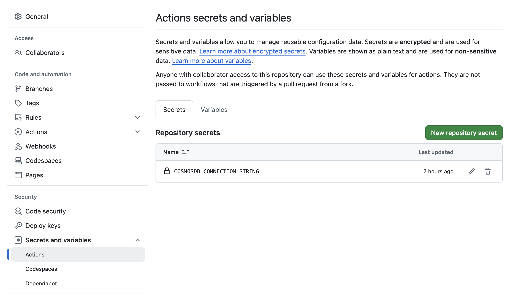
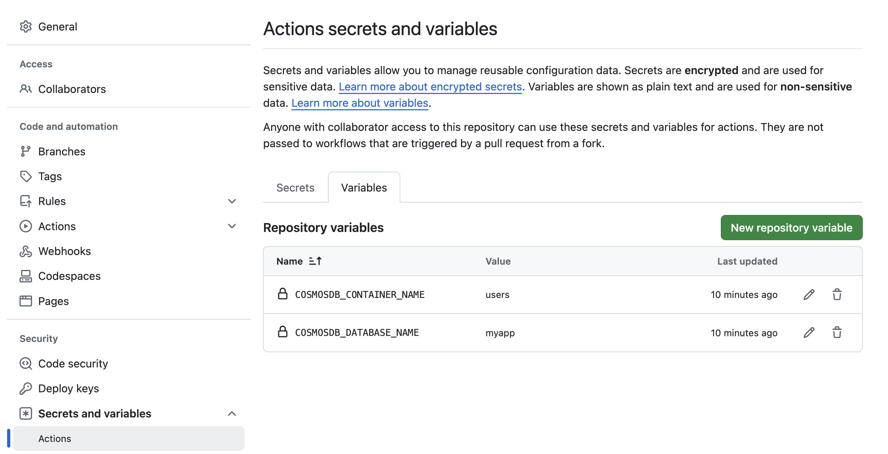

# Using Azure Cosmos DB Linux emulator (preview) in GitHub Actions

This repository demonstrates how to use the [Azure Cosmos DB Linux emulator](https://learn.microsoft.com/en-us/azure/cosmos-db/emulator-linux) in GitHub Actions to run integration tests. It configures the emulator as part of a GitHub Actions CI workflow for [Python](https://github.com/AzureCosmosDB/cosmosdb-linux-emulator-github-actions/blob/main/.github/workflows/python.yml), [Java](https://github.com/AzureCosmosDB/cosmosdb-linux-emulator-github-actions/blob/main/.github/workflows/java.yml) and [Go](https://github.com/AzureCosmosDB/cosmosdb-linux-emulator-github-actions/blob/main/.github/workflows/go.yml) applications.


> Read more in the [official documentation](TODO link).

## Try it out!

To fork this repository, click the **Fork** button at the top-right corner of the repository page to create a copy of the repository under your own GitHub account. Go to your GitHub account, open the repository and make sure to enable workflows in the repository settings.



Add the Cosmos DB emulator connection string (`COSMOSDB_CONNECTION_STRING`) as a [Repository secret](https://docs.github.com/en/actions/security-for-github-actions/security-guides/using-secrets-in-github-actions#creating-secrets-for-a-repository) to the repository. Use the following value: `AccountEndpoint=http://localhost:8081/;AccountKey=C2y6yDjf5/R+ob0N8A7Cgv30VRDJIWEHLM+4QDU5DE2nQ9nDuVTqobD4b8mGGyPMbIZnqyMsEcaGQy67XIw/Jw==`



Add database name (`COSMOSDB_DATABASE_NAME`) and container name (`COSMOSDB_CONTAINER_NAME`) as [Repository variables](https://docs.github.com/en/actions/writing-workflows/choosing-what-your-workflow-does/store-information-in-variables#creating-configuration-variables-for-a-repository):



Clone your forked repository to your local machine:

```bash
git clone https://github.com/your-username/cosmosdb-linux-emulator-github-actions.git
cd cosmosdb-linux-emulator-github-actions
```

To trigger the workflow, make a small change to any of the code (Java, Python, or Go), add and commit your changes. Note that only the workflow for the specific language you changed will run.

Push your changes to your forked repository on GitHub:

```bash
git add .
git commit -m "Your commit message"
git push origin main
```

After pushing your changes, GitHub Actions will automatically run the workflow. Go to the **Actions** tab in your repository to see the status and results of the workflows. Review any logs or output to ensure the workflows are running correctly.